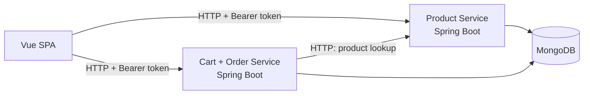

# Final Refined Architecture — 2-Hour Viable E-Commerce Demo

> **Status:** Accepted for the two-hour implementation window.
>
> **Purpose:** Define the smallest coherent architecture that preserves the core e-commerce demonstration while removing the infrastructure, distributed-systems, and identity-provider decisions that make the original architecture risky to complete in two hours.
>
> **Source basis:** This document is a refinement of the supplied deep-research architecture report and the subsequent viability review. The research explicitly describes the original topology as production-shaped and recommends aggressive prioritization for a strict two-hour implementation window. fileciteturn0file0L5-L19

---

## 1. Final Architecture Decision

The sprint architecture is:

- **Vue.js SPA** frontend.
- **Product Service** as a standalone Spring Boot application.
- **Cart + Order Service** as a single Spring Boot application containing separate logical modules for cart and order responsibilities.
- **One MongoDB instance** with separate `products`, `carts`, and `orders` collections.
- **Development-only stub authentication** behind Spring Security, exposing `ROLE_USER` and `ROLE_ADMIN` identities.
- **Direct browser-to-service HTTP** with CORS; no API Gateway.
- **RFC 7807 / Spring Problem Details** for backend error responses.
- **JUnit 5 + Mockito + MockMvc** for the small set of critical backend tests.
- **One Playwright golden-path E2E test** for the main user journey.
- **Docker Compose for MongoDB only** during the sprint.
- **One monorepo** containing the frontend, both backend applications, and deployment/configuration files.

The following are explicitly **out of scope for the two-hour implementation**:

- External Keycloak/Auth0/OIDC setup.
- API Gateway / Spring Cloud Gateway.
- Separate Cart and Order runtime services.
- Developer/Tester Dashboard.
- Distributed tracing.
- Pact / Spring Cloud Contract.
- Testcontainers.
- Kubernetes / Helm.
- Full CI/CD pipeline.
- Exhaustive Vue component/unit testing.

The original research independently places several of these items in future work or excludes them because of configuration and infrastructure overhead. fileciteturn0file0L780-L797

---

## 2. Architecture Shape



### Runtime boundaries

| Component | Responsibility | Sprint status |
|---|---|---|
| Vue SPA | Product browsing, cart UI, checkout, confirmation | Required |
| Product Service | Product existence, product reads, admin product mutation, price authority | Required |
| Cart + Order Service | Cart ownership/state, checkout, order persistence, idempotency | Required |
| MongoDB | Persistence for all three logical collections | Required |
| External OIDC provider | Production identity management | Deferred |
| API Gateway | Central ingress/routing/correlation filter | Deferred |
| Tester Dashboard | Operational/demo shortcuts | Deferred |

---

## 3. Why This Version Is Viable

The original design created several independent configuration surfaces: frontend, identity provider, gateway, three backend services, inter-service checkout, database wiring, observability, and E2E verification. The supplied research already identifies the two-hour constraint as requiring ruthless prioritization. fileciteturn0file0L5-L19

This version removes the highest-risk boundaries while preserving the core business flow:

```text
Vue
  |
  +----> Product Service
  |
  +----> Cart + Order Service
                 |
                 +----> Product Service (price/existence lookup)
                 |
                 +----> MongoDB
```

The key simplification is that **Cart and Order are no longer separate runtime services**. Therefore checkout does not require an Order → Cart HTTP call, and the original distributed checkout failure path is removed from the sprint architecture.

---

## 4. Explicit Decisions

### 4.1 Authentication: development stub, production-compatible security model

Real OIDC is intentionally deferred.

The application still uses Spring Security authorization concepts so the authentication mechanism can be replaced later.

Required development identities:

```text
Bearer user-token
  -> sub = user-1
  -> authorities = [ROLE_USER]

Bearer admin-token
  -> sub = admin-1
  -> authorities = [ROLE_USER, ROLE_ADMIN]
```

Implementation rule:

- A development authentication filter maps the two known bearer tokens to a `JwtAuthenticationToken`-style principal and authorities.
- The filter is enabled only under `@Profile("dev")`.
- Production configuration must not enable the development authentication profile.
- Controllers/services perform authorization based on Spring Security authorities and authenticated subject identity, not on the literal development token.

This preserves the security programming model while removing the identity-provider setup from the two-hour critical path.

---

### 4.2 API Gateway: removed from sprint scope

There is no API Gateway in this version.

The browser calls the two backend applications directly:

```text
Vue -> Product Service
Vue -> Cart + Order Service
```

Consequences:

- No Spring Cloud Gateway.
- No WebFlux `GlobalFilter` implementation.
- No gateway-generated correlation-ID chain.
- CORS must be configured directly on **both** backend applications.

The original research's gateway correlation-ID design is therefore deferred with the gateway itself. fileciteturn0file0L611-L644

---

### 4.3 Cart and Order: one deployable application

`Cart + Order Service` is one Spring Boot application, but the code remains logically separated:

```text
cart/
  controller/
  service/
  repository/
  model/

order/
  controller/
  service/
  repository/
  model/

checkout/
```

The separation is architectural/organizational rather than a network boundary.

This keeps the domain responsibilities understandable while avoiding the Order → Cart HTTP call that caused the largest checkout failure-model problem in the original architecture.

---

### 4.4 Product Service owns product truth and price

The Product Service is authoritative for:

- Product existence.
- Product name.
- Product price.
- Product administration.

When an authenticated user adds a product to a cart:

```text
Cart + Order Service
        |
        | GET /api/products/{id}
        v
Product Service
        |
        +--> product exists?
        +--> current server price
        +--> product name
```

The cart stores a **server-side price snapshot**:

```json
{
  "productId": "p-100",
  "name": "Keyboard",
  "unitPrice": 2499,
  "quantity": 2
}
```

The frontend never becomes the source of truth for price.

The research explicitly requires backend-only order total calculation and says frontend price submissions must not be trusted. fileciteturn0file0L141-L148

---

### 4.5 Product ID validation

Product existence is validated when an item is added to the cart.

Responsibility is therefore:

```text
Product Service
  -> owns product existence and price

Cart + Order Service
  -> validates add-to-cart requests by calling Product Service
  -> owns cart item quantity and price snapshot
```

Invalid/non-existent product IDs are rejected rather than stored as unresolved references.

---

### 4.6 Persistence ownership

One MongoDB instance is used for the sprint:

```text
MongoDB
├── products
├── carts
└── orders
```

Logical ownership is strict:

| Collection | Owner |
|---|---|
| `products` | Product Service |
| `carts` | Cart module in Cart + Order Service |
| `orders` | Order module in Cart + Order Service |

No service/module should bypass its application boundary by directly reading or mutating another module's collection.

---

## 5. API Surface

### 5.1 Product Service

```http
GET    /api/products
GET    /api/products/{id}
POST   /api/products              # ROLE_ADMIN
PUT    /api/products/{id}         # ROLE_ADMIN
DELETE /api/products/{id}         # ROLE_ADMIN
```

### 5.2 Cart + Order Service

```http
GET    /api/cart
POST   /api/cart/items
PATCH  /api/cart/items/{productId}
DELETE /api/cart/items/{productId}
DELETE /api/cart

POST   /api/orders/checkout
GET    /api/orders
GET    /api/orders/{id}
```

### 5.3 Security rules

| Capability | ROLE_USER | ROLE_ADMIN |
|---|---:|---:|
| Read products | Yes | Yes |
| Add/update/remove own cart items | Yes | Yes |
| Checkout | Yes | Yes |
| Read own orders | Yes | Yes |
| Create/update/delete products | No | Yes |

Cart and order ownership is based on the authenticated principal's `sub` / user ID.

---

## 6. Minimal Data Model

### 6.1 Product

```json
{
  "id": "p-100",
  "name": "Keyboard",
  "price": 2499
}
```

### 6.2 Cart

```json
{
  "id": "cart-user-1",
  "userId": "user-1",
  "items": [
    {
      "productId": "p-100",
      "name": "Keyboard",
      "unitPrice": 2499,
      "quantity": 2
    }
  ]
}
```

### 6.3 Order

```json
{
  "id": "ord-1001",
  "userId": "user-1",
  "idempotencyKey": "checkout-abc-123",
  "items": [
    {
      "productId": "p-100",
      "name": "Keyboard",
      "unitPrice": 2499,
      "quantity": 2
    }
  ],
  "total": 4998,
  "status": "CONFIRMED"
}
```

The order is an immutable business snapshot. Later product changes must not alter historical order values.

### Stock field decision

The earlier model contained `stock`, but the sprint requirements do not define stock reservation, inventory mutation, or checkout stock validation.

Therefore:

> **Do not implement stock behavior in the two-hour sprint.**

The preferred sprint model is to omit the `stock` field entirely. If an existing scaffold already contains it, it may remain unused, but no checkout rule may depend on it.

---

## 7. Checkout Design

### 7.1 Request

```http
POST /api/orders/checkout
Idempotency-Key: 8f5e...
Authorization: Bearer user-token
```

### 7.2 Flow

```text
Checkout request
      |
      v
Authenticate user
      |
      v
Load user's cart
      |
      +---- empty ----> 409 Conflict
      |
      v
Check idempotency key
      |
      +---- existing ----> replay existing order
      |
      v
Calculate total from server-owned cart prices
      |
      v
Persist order snapshot
      |
      v
Clear cart
      |
      v
Return order confirmation
```

### 7.3 Non-atomicity decision

Checkout is **not claimed to be fully atomic** across the order write and cart clear.

Possible failure:

```text
order save succeeds
        |
        v
cart clear fails
        |
        v
order exists + cart still contains items
```

This is an accepted sprint limitation.

The architecture therefore states explicitly:

> Checkout is a local orchestration flow with best-effort cart clearing, not a distributed or multi-document transactional guarantee.

The idempotency mechanism reduces the impact of retries by ensuring that reuse of the same `(userId, idempotencyKey)` does not create another order.

Do **not** describe checkout as "atomic" in the final project write-up.

---

## 8. Idempotency

The checkout endpoint requires an `Idempotency-Key` header.

The orders collection must enforce uniqueness on:

```text
(userId, idempotencyKey)
```

Create a unique compound index equivalent to:

```javascript
{ userId: 1, idempotencyKey: 1 }
```

with uniqueness enabled.

### Required behavior

```text
First request with key K
    -> create order
    -> persist K with order

Second request with same user + K
    -> return/replay the existing order
    -> do not create another order
```

Code-level "check then insert" without a database uniqueness constraint is insufficient because two simultaneous requests can race.

---

## 9. Error Handling

Use Spring Problem Details / RFC 7807-style responses consistently across both Spring Boot applications.

The research recommends this standardized error approach and specifically identifies Spring Boot's `ProblemDetail` support as a high-value simplification. fileciteturn0file0L505-L525

### Status mapping

| Condition | HTTP |
|---|---:|
| Invalid request / validation failure | 400 |
| Missing/invalid authentication | 401 |
| Insufficient role or ownership violation | 403 |
| Product/cart/order not found | 404 |
| Empty cart / duplicate checkout conflict | 409 |
| Unexpected backend failure | 500 |

### Frontend mapping

```text
400 -> validation/request message
401 -> authentication message / return to dev login state
403 -> Access Denied
404 -> Not Found
409 -> conflict/checkout message
500 -> generic Service Error
```

Never expose Java stack traces, MongoDB errors, or internal exception details directly to the browser.

---

## 10. CORS

Because the gateway has been removed, both backend applications must explicitly permit the Vue development origin.

Configure CORS once per backend application with the same policy, for example:

```text
Allowed origin: Vue dev origin
Allowed methods: GET, POST, PUT, PATCH, DELETE, OPTIONS
Allowed headers: Authorization, Content-Type, Idempotency-Key
```

Do not spend sprint time building a centralized CORS abstraction.

The goal is simply to make browser-to-service requests work reliably.

---

## 11. Testing Strategy

The research recommends prioritizing tests that protect authorization, financial correctness, state transitions, and critical request validation rather than spending the sprint on exhaustive unit coverage. fileciteturn0file0L167-L169

### 11.1 Backend — mandatory

Write only the tests that protect the core risks:

1. Product creation rejects invalid input.
2. `ROLE_USER` cannot mutate products; `ROLE_ADMIN` can.
3. Adding the same product increments quantity instead of duplicating the line.
4. A user cannot access another user's cart.
5. Empty-cart checkout is rejected.
6. Checkout total is calculated from server-controlled prices.
7. Checkout creates an order snapshot and clears the cart on the normal path.
8. Reusing the same idempotency key does not create a second order.

Preferred stack:

- JUnit 5.
- Mockito.
- `spring-boot-starter-test`.
- MockMvc.
- `spring-security-test`.

The research specifically recommends MockMvc for the blocking Spring MVC architecture and `jwt()`-style security test support for testing authorization without standing up a real identity provider. fileciteturn0file0L264-L301

### 11.2 Frontend — one E2E test

Use exactly one primary Playwright journey:

```text
Authenticate as user
    -> browse products
    -> add product
    -> increase quantity
    -> checkout
    -> verify order confirmation
    -> verify cart is empty
```

The research recommends Playwright as the high-value frontend verification mechanism for the two-hour sprint and specifically proposes a consolidated golden-path journey. fileciteturn0file0L356-L386

### 11.3 What gets cut first

If the schedule slips:

1. Cut optional Playwright negative scenarios.
2. Keep the single golden-path Playwright test only if time remains.
3. Do **not** cut the critical backend security, cart-state, price-authority, or idempotency tests.
4. Keep the UI minimal rather than adding polish.

---

## 12. Minimal Observability

Use:

- Standard console logging.
- Useful request/error messages.
- `/actuator/health` on both backend applications.

Do not implement during the sprint:

- OpenTelemetry.
- Jaeger.
- Zipkin.
- ELK.
- Gateway correlation filtering.

A full distributed correlation chain belongs with the future gateway/observability architecture.

---

## 13. Docker / Local Environment

Use Docker Compose for MongoDB only:

```yaml
services:
  mongo:
    image: mongo
    ports:
      - "27017:27017"
```

Development runtime:

```text
MongoDB -> Docker Compose
Spring Boot services -> IDE / local JVM
Vue -> local dev server
```

Do not spend the two-hour window building optimized Java images or a full multi-container application stack.

---

## 14. Monorepo Layout

```text
project/
├── frontend/
├── product-service/
├── cart-order-service/
├── infra/
│   └── docker-compose.yml
├── e2e/
├── README.md
└── .gitignore
```

Suggested backend package shape:

```text
product-service/
└── src/main/java/.../product/
    ├── controller/
    ├── service/
    ├── repository/
    ├── model/
    └── security/

cart-order-service/
└── src/main/java/.../
    ├── cart/
    │   ├── controller/
    │   ├── service/
    │   ├── repository/
    │   └── model/
    ├── order/
    │   ├── controller/
    │   ├── service/
    │   ├── repository/
    │   └── model/
    ├── checkout/
    └── security/
```

---

## 15. 120-Minute Implementation Plan

### 0–15 minutes — project skeleton

- Create monorepo.
- Generate Product Service.
- Generate Cart + Order Service.
- Generate Vue app.
- Start MongoDB with Compose.

### 15–30 minutes — authentication + Product Service

- Add dev authentication filter.
- Protect it with `@Profile("dev")`.
- Implement product model/repository/controller.
- Seed a small set of products.
- Verify admin-only product mutation.

### 30–60 minutes — cart

- Implement cart document.
- Implement add/update/remove/clear.
- Derive ownership from authenticated `sub`.
- Implement Product Service lookup during add.
- Store server-side `unitPrice` snapshot.

### 60–85 minutes — checkout/order

- Implement order document.
- Implement checkout.
- Calculate total from cart snapshots.
- Add `Idempotency-Key` handling.
- Add unique `(userId, idempotencyKey)` index.
- Clear cart on successful normal-path checkout.

### 85–105 minutes — Vue UI

Keep the UI intentionally minimal:

- One product list page.
- Add-to-cart button.
- Cart quantity controls.
- Checkout button.
- Confirmation state.
- Very simple dev login/token selector.

Do not spend time on styling or visual polish.

### 105–110 minutes — CORS + integration wiring

- Configure CORS on both services.
- Verify frontend can call both backends.
- Verify auth headers and `Idempotency-Key` reach the correct endpoints.

### 110–120 minutes — verification

Run:

- Backend critical tests.
- Single Playwright golden path, if time allows.
- Manual admin/user verification.
- Empty-cart checkout verification.
- Duplicate idempotency request verification.

Do not add infrastructure after minute 110.

---

## 16. Explicit Remaining Risks

These are acknowledged limitations, **not blockers** for the two-hour sprint.

### Risk 1 — frontend schedule pressure

Fifteen minutes for the frontend is optimistic. The mitigation is intentional UI minimalism.

The UI may be plain and ugly; it only needs to demonstrate the business flow.

### Risk 2 — checkout is not fully atomic

An order can be persisted while cart clearing fails.

Mitigation:

- Explicitly document the behavior.
- Use idempotency to prevent duplicate orders on retry with the same key.
- Do not claim transactional atomicity.

### Risk 3 — idempotency race

Application-level checks alone can race.

Mitigation:

- Unique compound index on `(userId, idempotencyKey)`.
- Handle duplicate-key result by replaying/loading the existing order.

### Risk 4 — development authentication glue

The dev auth filter is custom sprint glue.

Mitigation:

- Keep it behind `@Profile("dev")`.
- Keep Spring Security authorities/principal semantics unchanged.
- Replace the authentication provider later without changing business authorization rules.

### Risk 5 — CORS configuration

With no gateway, each backend must accept the Vue origin.

Mitigation:

- Configure identical CORS policy in both applications early, before debugging frontend behavior.

### Risk 6 — stock is undefined

Inventory semantics are not part of the sprint requirements.

Mitigation:

- Omit `stock` from the sprint model, or leave it unused.
- Do not introduce stock reservation/checkout logic.

---

## 17. Acceptance Gate

The architecture is accepted for the two-hour implementation only when all of the following are true:

- [x] No external OIDC provider is required to start development.
- [x] Development authentication is isolated behind a Spring Security-compatible mechanism.
- [x] Development authentication is restricted to the `dev` profile.
- [x] No API Gateway is required.
- [x] Cart and Order are one deployable service.
- [x] Product Service owns product existence and price.
- [x] Cart validation calls Product Service.
- [x] Cart stores a server-side price snapshot.
- [x] Cart and Order use the authenticated subject for ownership.
- [x] Collections are explicitly `products`, `carts`, and `orders`.
- [x] Checkout's non-atomic behavior is explicitly documented.
- [x] Duplicate checkout behavior is explicitly defined.
- [x] `(userId, idempotencyKey)` has a unique MongoDB index.
- [x] CORS is configured on both backends.
- [x] Stock logic is explicitly out of sprint scope.
- [x] Backend critical tests are prioritized over UI polish.
- [x] One Playwright golden path is sufficient for frontend E2E verification.
- [x] MongoDB can be started with one Compose command.
- [x] No additional infrastructure is required for the core demo path.

---

## 18. Definition of Done

The sprint is done when a reviewer can run the system and demonstrate this sequence:

```text
Start MongoDB
   |
   v
Start Product Service
   |
   v
Start Cart + Order Service
   |
   v
Start Vue SPA
   |
   v
Authenticate as user
   |
   v
Browse products
   |
   v
Add product to cart
   |
   v
Increase quantity
   |
   v
Checkout with Idempotency-Key
   |
   v
Order confirmation shown
   |
   v
Cart is empty
```

The reviewer can also demonstrate:

```text
USER token + product mutation -> 403
ADMIN token + product mutation -> success
non-existent product add     -> rejected
empty cart checkout          -> 409
same idempotency key again   -> same order / no duplicate
cross-user cart access       -> 403
```

Anything outside this flow is considered optional for the two-hour sprint.

---

## 19. Future Evolution Path

This sprint architecture is intentionally a **stepping stone**, not the final production topology.

A later evolution can introduce, in this order:

```text
1. Real OIDC/JWKS validation
        |
2. API Gateway
        |
3. Separate Cart and Order services
        |
4. Explicit service-to-service authentication
        |
5. Stronger checkout consistency strategy
        |
6. Contract tests
        |
7. Distributed tracing
        |
8. Containerized deployment / orchestration
```

The important constraint is that those future additions should not require rewriting the core business authorization rules, Product price ownership, cart ownership model, or order snapshot representation.

---

## 20. Final Architectural Position

This is the **accepted two-hour architecture**.

It intentionally trades deployment sophistication and distributed-system completeness for implementation certainty while preserving the critical business/security properties identified by the research:

- authenticated user identity,
- role-based product administration,
- user-owned carts,
- server-authoritative pricing,
- immutable order snapshots,
- duplicate-checkout protection,
- standardized errors,
- targeted backend verification,
- one realistic end-to-end business journey.

The original research's testing priorities emphasize authorization, financial correctness, state transitions, checkout behavior, and inter-service failure handling; this reduced architecture removes the inter-service checkout boundary rather than attempting to solve it inside the two-hour sprint. fileciteturn0file0L451-L472

